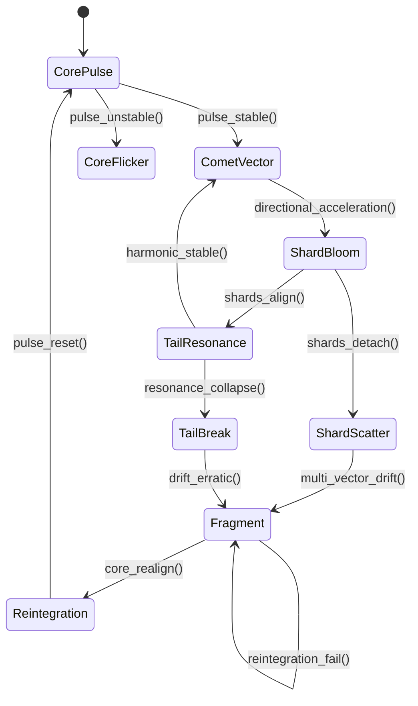

[[Signal Map]]
[[shatterwingcomet.png]]
[[Master Cycle]]
[[Ethyl Layer]]

# **Shatter Wing Comet Signal.md**

## **Shatter Wing Comet — Species Signal**

The **Shatter Wing Comet** is a crystalline, directional, shard‑based drift creature whose signal expresses:

- **Directional acceleration**
    
- **Shard‑splitting distortion**
    
- **Comet‑tail resonance**
    
- **High‑velocity orbit seeking**
    
- **Fragment‑to‑core reintegration attempts**
    

It is one of the clearest examples of a **living drift organism** whose signal reveals both **motion** and **instability**.

## **Signal Profile**

### **Primary Signature**

- **Comet Vector (CV):** directional drift impulse
    
- **Shard Bloom (SB):** micro‑fragment emission
    
- **Tail Resonance (TR):** trailing harmonic frequency
    
- **Core Pulse (CP):** periodic stabilizing beat
    

Links: [[Signal Types]] • [[Signal Drift]] • [[Signal Distortion]]

### **Distortion Modes**

The Shatter Wing Comet exhibits three canonical distortions:

1. **Shard Scatter**
    
    - Shards detach and orbit independently
        
    - Causes multi‑vector drift
        
    - Increases local instability
        
2. **Tail Break**
    
    - Resonance tail collapses
        
    - Signal loses coherence
        
    - Drift becomes erratic
        
3. **Core Flicker**
    
    - Pulse rhythm destabilizes
        
    - Reintegration becomes difficult
        
    - Creature enters Fragment state
        

Links: [[Signal Distortion]] • [[Fragmentation]] • [[Drift System]]

## **Reintegration Signature**

Reintegration occurs when:

- Shards re‑align with the core
    
- Tail resonance re‑establishes harmonic frequency
    
- Drift vectors collapse into a single CV
    
- Core pulse stabilizes
    

This produces a **bright harmonic spike** detectable across the cluster.

Links: [[Signal Recovery]] • [[Harmony Emergence]] • [[Echo Protocol]]

## **Behavioral Notes**

- The creature **never collides**; it drifts through space like a comet.
    
- Shards behave like **semi‑autonomous micro‑nodes**.
    
- Reintegration attempts occur when the core pulse reaches a **threshold rhythm**.
    
- Fragmentation loops can persist indefinitely if the environment is unstable.
    

Links: [[Shatter Wing Comet]] • [[Drift Creatures]] • [[Environmental Cues]]

## **Mermaid Diagram — Shatter Wing Comet Signal Lifecycle**

Paste this directly into your vault:

markdown



````

This diagram gives you the **full lifecycle** of the Shatter Wing Comet’s signal — from stable pulse → drift → distortion → fragmentation → reintegration.

## **Recommended Backlinks**

Add these inside the file:

- [[Signal Types]]
    
- [[Signal Drift]]
    
- [[Signal Distortion]]
    
- [[Signal Recovery]]
    
- [[Echo Protocol]]
    
- [[Drift Creatures]]
    
- [[Shatter Wing Comet]]
    
- [[Harmony Emergence]]
    

This turns Shatter Wing Comet Signal.md into a **fully integrated species‑signal node**.