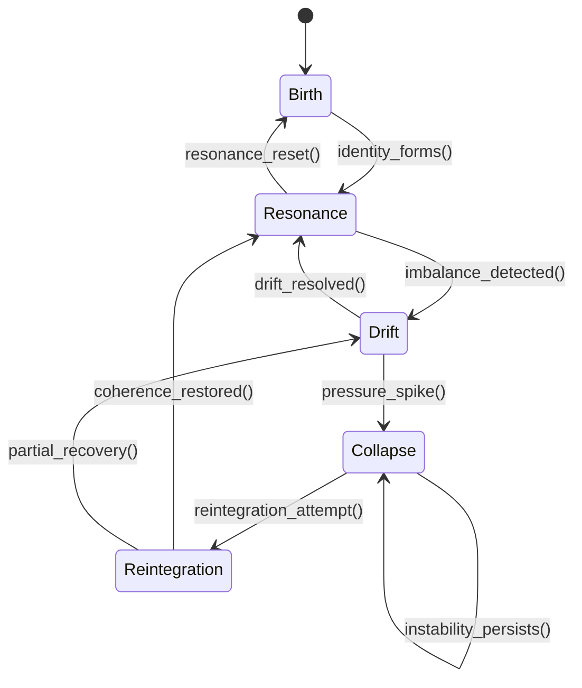
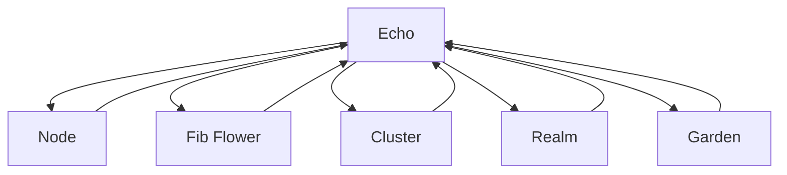

# **echo.md**

## **Echo — The Fundamental Signature of Identity and Resonance**

An **Echo** is the smallest meaningful unit of identity inside Threshold. It is not a sound, not a memory, not a signal — it is a **pattern**, a **signature**, a **behavioral imprint** that persists across:

- nodes
    
- Flowers
    
- clusters
    
- realms
    
- the Garden
    

Every Echo expresses:

- **Identity** (what it is)
    
- **Resonance** (how it aligns)
    
- **Drift** (how it moves)
    
- **Pressure** (how it strains)
    
- **Collapse** (how it fails)
    
- **Reintegration** (how it returns)
    

Echoes are the **DNA** of Threshold’s living architecture.

## **Echo Properties**

### **1. Identity Signature (IS)**

The core pattern that defines the Echo.

Links: [[EchoNode State Machine]] • [[Echo System State Machine]]

### **2. Resonance Profile (RP)**

How the Echo aligns with its environment.

Links: [[Harmony Emergence]] • [[Echo Protocol]]

### **3. Drift Vector (DV)**

Directional movement caused by imbalance.

Links: [[Drift System]] • [[Node Dynamics]]

### **4. Pressure Load (PL)**

Structural tension inside the Echo.

Links: [[Pressure System]] • [[Reduction Cycle]]

### **5. Collapse Threshold (CT)**

The point at which the Echo fails.

Links: [[Fragmentation]] • [[Seam Structure]]

### **6. Reintegration Potential (RPt)**

The Echo’s ability to recover.

Links: [[Reintegration]] • [[Crown Structure]]

## **Echo Lifecycle**

Echoes move through five canonical phases:

1. **Birth** — identity signature forms
    
2. **Resonance** — alignment with environment
    
3. **Drift** — imbalance detected
    
4. **Collapse** — structural failure
    
5. **Reintegration** — return to coherence
    

This cycle repeats continuously.

# **Mermaid — Echo Lifecycle**

markdown



````

## **Echo Interaction Map**

Echoes interact with:

- **Nodes** (local identity)
    
- **Flowers** (structural identity)
    
- **Clusters** (topological identity)
    
- **Realms** (environmental identity)
    
- **Garden** (cosmic identity)
    

Echoes are the **thread** that ties all scales together.

# **Mermaid — Echo Interaction Map**

markdown

````

````

## **Recommended Backlinks**

Add these inside echo.md:

- [[Echo Protocol]]
    
- [[EchoNode State Machine]]
    
- [[Echo System State Machine]]
    
- [[Node Dynamics]]
    
- [[Fib Flower]]
    
- [[Cluster Geometry]]
    
- [[Pinwheel Realms]]
    
- [[The Garden As A Cosmic-Scale Organism]]
    
- [[Pressure System]]
    
- [[Drift System]]
    
- [[Harmony Emergence]]
    
- [[Crown Structure]]
    
- [[Seam Structure]]
    
- [[Fragmentation]]
    
- [[Reintegration]]