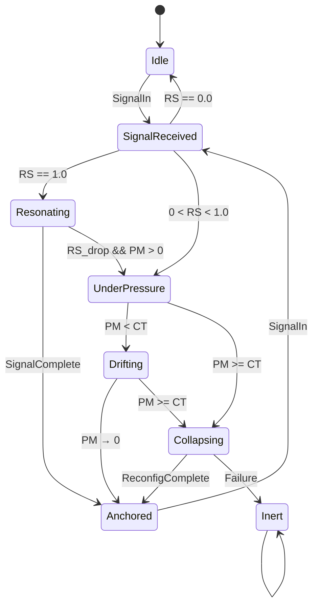

# **EchoNode State Table**

### **Table 1 — Node State Machine (EchoNode)**

Code

```mermaid
| State           | Input / Condition                     | Output / Action                     | Next State        | Notes |
|-----------------|----------------------------------------|--------------------------------------|-------------------|-------|
| Idle            | SignalIn                               | evaluate_resonance()                 | SignalReceived    | Node wakes on signal |
| SignalReceived  | RS == 1.0                              | process_signal()                     | Resonating        | Perfect match |
| SignalReceived  | 0 < RS < 1.0                           | compute_PM_DV()                      | UnderPressure     | Partial match |
| SignalReceived  | RS == 0.0                              | discard_signal()                     | Idle              | No resonance |
| Resonating      | SignalComplete                          | finalize_processing()                | Anchored          | Stable integration |
| Resonating      | RS_drop && PM > 0                      | compute_PM_DV()                      | UnderPressure     | Resonance destabilized |
| UnderPressure   | PM < CT                                | apply_drift(DV)                      | Drifting          | Drift begins |
| UnderPressure   | PM >= CT                               | reset_state()                        | Collapsing        | Collapse triggered |
| Drifting        | PM → 0                                 | set_anchor_state()                   | Anchored          | Drift resolves |
| Drifting        | PM >= CT                               | reset_state()                        | Collapsing        | Collapse mid‑drift |
| Collapsing      | ReconfigComplete                       | set_anchor_state()                   | Anchored          | Successful reconfig |
| Collapsing      | Failure                                | inert_state()                        | Inert             | Node becomes inert |
| Anchored        | SignalIn                               | evaluate_resonance()                 | SignalReceived    | New cycle |
| Inert           | —                                      | —                                    | Inert             | Terminal |
```


# **EchoNode — Mermaid State Diagram**

mermaid

