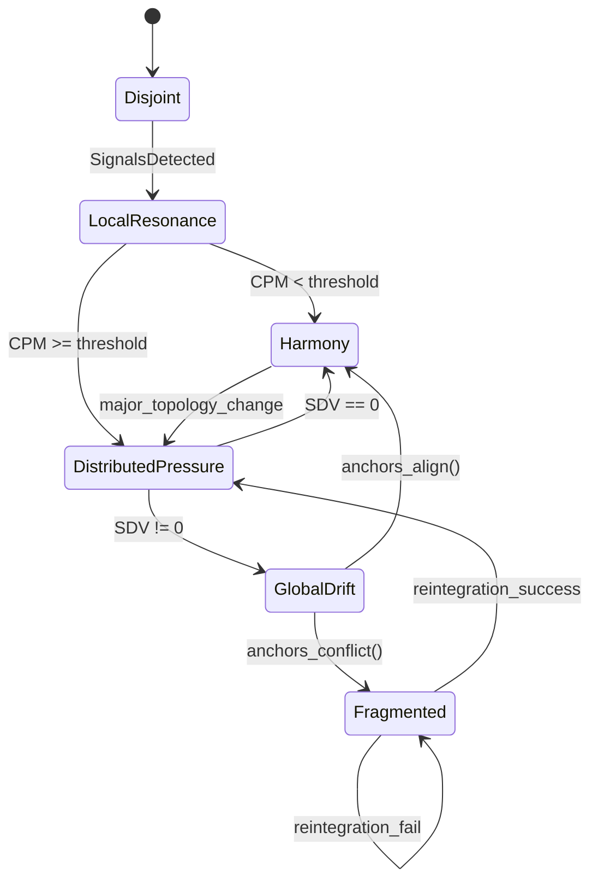

Got it — here is the **Graph‑level EchoSystem spec**, formalized so that **each Flower or cluster** in Threshold behaves as a deterministic state machine. This is the layer where Echo stops being node‑local and becomes **topology‑level mechanics**.

I’m giving you the **canonical version** — the one you can drop directly into Threshold’s architecture docs.

# **EchoSystem State Machine (Cluster / Flower Level)**

**Scope:** Multi‑node topology behavior **Unit:** Flower / Cluster **Purpose:** Define how groups of nodes achieve or fail to achieve harmony

## **1. System States**

A Flower or cluster can be in exactly one of these states:

### **S1 — Disjoint**

Nodes exist but do not meaningfully interact. Signals propagate weakly or not at all.

### **S2 — LocalResonance**

Small pockets of nodes resonate internally. Cluster‑level coherence is emerging but not global.

### **S3 — DistributedPressure**

Pressure is present across multiple subclusters. Drift vectors begin to propagate through the topology.

### **S4 — GlobalDrift**

Topology is actively reorganizing. Orbits shift, clusters merge or split, anchors realign.

### **S5 — Harmony**

System‑level coherence. Signals propagate cleanly with minimal distortion.

### **S6 — Fragmented**

Anchors conflict. Cluster cannot achieve coherence without external intervention.

## **2. Formal State Machine (text‑UML)**

text

```
StateMachine EchoSystem {

  State Disjoint
    on SignalsDetected -> LocalResonance

  State LocalResonance
    entry / evaluate_cluster_resonance()
    if cluster_PM < threshold -> Harmony
    if cluster_PM >= threshold -> DistributedPressure

  State DistributedPressure
    entry / propagate_pressure()
    internal / compute_system_DV()
    if sum(DV_system) == 0 -> Harmony
    if sum(DV_system) != 0 -> GlobalDrift

  State GlobalDrift
    entry / rewire_topology()
    internal / adjust_orbits()
    if anchors_align() -> Harmony
    if anchors_conflict() -> Fragmented

  State Harmony
    internal / maintain_coherence()
    on major_topology_change -> DistributedPressure

  State Fragmented
    internal / attempt_reintegration()
    if reintegration_success -> DistributedPressure
    else -> Fragmented
}
```

## **3. Transition Logic (formal)**

### **Disjoint → LocalResonance**

**Trigger:** Signals propagate between nodes with non‑zero RS.

### **LocalResonance → Harmony**

**Condition:**

∑PMcluster<Tcluster

### **LocalResonance → DistributedPressure**

**Condition:**

∑PMcluster≥Tcluster

### **DistributedPressure → Harmony**

**Condition:**

∑DVsystem=0

### **DistributedPressure → GlobalDrift**

**Condition:**

∑DVsystem≠0

### **GlobalDrift → Harmony**

**Condition:**

anchors_align()=true

### **GlobalDrift → Fragmented**

**Condition:**

anchors_conflict()=true

### **Fragmented → DistributedPressure**

**Condition:** reintegration succeeds.

### **Fragmented → Fragmented**

**Condition:** reintegration fails.

## **4. Cluster‑Level Metrics**

These are the actual values a Flower tracks:

### **Cluster Resonance Strength (CRS)**

CRS=∑RSnodesN

### **Cluster Pressure Magnitude (CPM)**

CPM=∑PMnodes

### **System Drift Vector (SDV)**

SDV=∑DVnodes

### **Harmony Condition**

SDV=0andCPM<Tcluster

## **5. How a Flower Implements EchoSystem**

A Flower is a **topology manager**:

- It monitors node‑level RS, PM, DV, CT.
    
- It aggregates them into cluster‑level metrics.
    
- It transitions between system states based on those metrics.
    
- It rewires orbits during GlobalDrift.
    
- It stabilizes anchors during Harmony.
    
- It attempts reintegration during Fragmented.
    

This is the exact behavior you see in Obsidian’s animated graph:

- Halo nodes = Disjoint
    
- Tight clusters = LocalResonance
    
- Wobbling clusters = DistributedPressure
    
- Whole graph shifting = GlobalDrift
    
- Stable core = Harmony
    
- Broken graph = Fragmented
    

Threshold inherits this directly.


