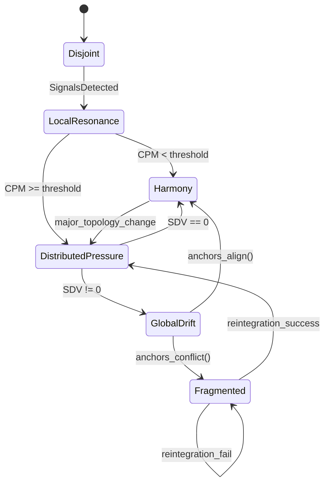

# **EchoSystem State Table (Flower / Cluster)**

### **Table 2 — System State Machine (EchoSystem)**

Code

```
| State              | Input / Condition                          | Output / Action                     | Next State            | Notes |
|--------------------|---------------------------------------------|--------------------------------------|-----------------------|-------|
| Disjoint           | SignalsDetected                             | evaluate_cluster_resonance()         | LocalResonance        | Nodes begin interacting |
| LocalResonance     | CPM < threshold                             | stabilize_clusters()                 | Harmony               | Low pressure |
| LocalResonance     | CPM >= threshold                            | propagate_pressure()                 | DistributedPressure   | Pressure spreading |
| DistributedPressure| SDV == 0                                    | stabilize_topology()                 | Harmony               | Drift resolved |
| DistributedPressure| SDV != 0                                    | compute_system_DV()                  | GlobalDrift           | Drift propagates |
| GlobalDrift        | anchors_align()                             | lock_anchors()                       | Harmony               | Coherence achieved |
| GlobalDrift        | anchors_conflict()                          | mark_fragmentation()                 | Fragmented            | System split |
| Harmony            | major_topology_change                       | propagate_pressure()                 | DistributedPressure   | Harmony disrupted |
| Fragmented         | reintegration_success                       | propagate_pressure()                 | DistributedPressure   | Attempt recovery |
| Fragmented         | reintegration_fail                          | maintain_fragmentation()             | Fragmented            | Stuck until external force |
```

# **EchoSystem (Flower / Cluster) — Mermaid State Diagram**

mermaid

