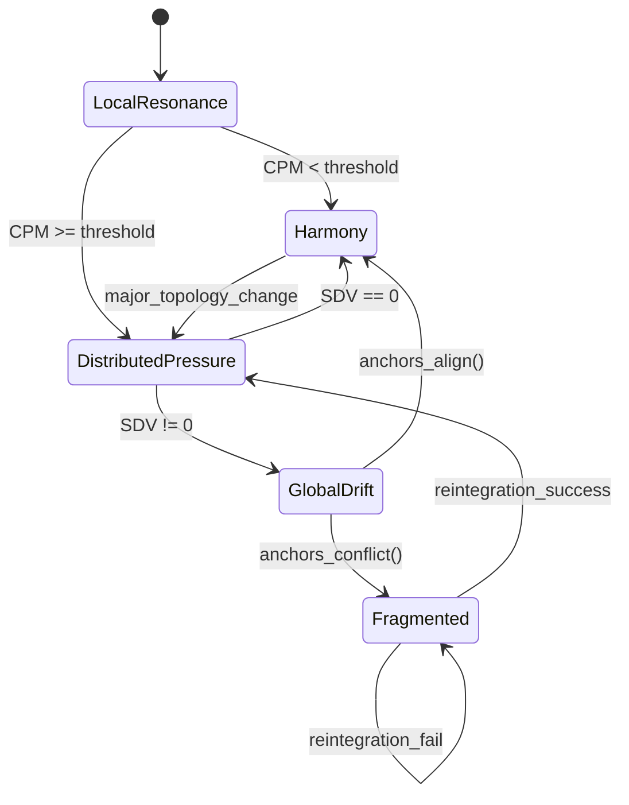

# **Harmony Emergence Diagram (Mermaid)**

markdown

````

## **What this diagram represents (quick recap)**

**Harmony emerges** when:

- **Cluster Pressure Metric (CPM)** is below threshold
    
- **System Drift Vector (SDV)** resolves to zero
    
- **Anchors align** during global drift
    

And **Harmony collapses** when:

- topology changes
    
- pressure spikes
    
- anchors conflict
    
- reintegration fails
    

This diagram shows the **exact pathways** into and out of Harmony — the “stable orbit” state of a Flower or cluster.